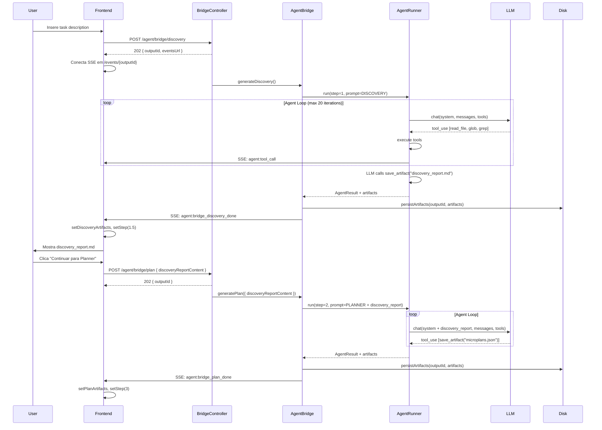

# Relatório: Implementação do Discovery Step

**Data**: 2026-02-07
**Objetivo**: Dividir o Step 1 (Planner) em duas fases: 1a) Discovery e 1b) Planner

---

## 📋 Sumário Executivo

O sistema atual possui 4 steps no pipeline de agentes:
1. **Planner** - Gera plan.json + microplans.json + contract.md
2. **Spec Writer** - Gera arquivos de teste
3. **Fixer** - Corrige artefatos rejeitados
4. **Coder** - Implementa o código

**Proposta**: Inserir um novo step **Discovery** antes do Planner para mapear arquivos, coletar snippets, confirmar hipóteses e gerar um report de contexto. Isso permitirá que o Planner trabalhe com informações mais precisas e reduza alucinações.

**Resultado Final**:
```
Step 1a: Discovery   → discovery_report.md (tags XML para parsing)
Step 1b: Planner     → microplans.json (MP-1=teste, MP-2+=código)
                        ↓
                   Orquestrador extrai MP-1 do microplans.json
                        ↓
Step 2:  Spec Writer → recebe MP-1, CRIA o arquivo .spec.ts
                        ↓
Step 3:  Gates       → valida o teste (syntax, happy/sad path, resilience)
                        ↓
                   Se falhou → Fixer recebe MP-1 + erro, corrige teste
                   Se passou ↓
                        ↓
                   Orquestrador extrai MP-2, MP-3... do microplans.json
                        ↓
Step 4:  Coder       → recebe MP-2, implementa código que faz teste passar
                        ↓
Step 3:  Gates       → valida (compilation, test passes, lint)
                        ↓
                   Se falhou → Fixer recebe MP-2 + erro, corrige código
                   Se passou → próximo microplan (MP-3, MP-4...)
                        ↓
         Gates 3     → regression + build no resultado final
```

---

## 🏗️ Arquitetura Atual

### Pipeline de Phases (AgentOrchestratorBridge)

```typescript
// packages/gatekeeper-api/src/services/AgentOrchestratorBridge.ts

class AgentOrchestratorBridge {
  // Step 1: Planner
  async generatePlan(input: BridgePlanInput): Promise<BridgePlanOutput>

  // Step 2: Spec Writer
  async generateSpec(input: BridgeSpecInput): Promise<BridgeSpecOutput>

  // Step 3: Fixer (corrige plan ou spec)
  async fixArtifacts(input: BridgeFixInput): Promise<BridgeFixOutput>

  // Step 4: Coder
  async execute(input: BridgeExecuteInput): Promise<BridgeExecuteOutput>
}
```

### Estrutura de Dados

```prisma
// packages/gatekeeper-api/prisma/schema.prisma

model AgentPhaseConfig {
  step                  Int      @id  // 1, 2, 3, 4
  provider              String   @default("claude-code")
  model                 String   @default("claude-sonnet-4-5-20250929")
  maxTokens             Int      @default(8192)
  maxIterations         Int      @default(30)
  maxInputTokensBudget  Int      @default(0)
  temperature           Float?
  fallbackProvider      String?
  fallbackModel         String?
  createdAt             DateTime @default(now())
  updatedAt             DateTime @updatedAt
}

model PromptInstruction {
  id        String   @id @default(cuid())
  name      String   @unique
  content   String
  step      Int?     // null = generic, 1-4 = pipeline step
  kind      String?  // 'instruction' | 'doc' | 'prompt'
  role      String   @default("system")  // 'system' | 'user'
  order     Int      @default(0)
  isActive  Boolean  @default(true)
  createdAt DateTime @default(now())
  updatedAt DateTime @updatedAt
}
```

### Fluxo de Execução (Backend)

```typescript
// packages/gatekeeper-api/src/api/controllers/BridgeController.ts

class BridgeController {
  async generatePlan(req, res) {
    // 1. Gera outputId
    const outputId = generateOutputId(taskDescription)

    // 2. Retorna 202 imediatamente (cliente conecta SSE)
    res.status(202).json({ outputId, eventsUrl: `/api/orchestrator/events/${outputId}` })

    // 3. Roda em background
    setImmediate(async () => {
      const result = await bridge.generatePlan({
        taskDescription,
        projectPath,
        outputId
      }, {
        onEvent: (event) => OrchestratorEventService.emit(outputId, event)
      })

      // 4. Emite completion event
      OrchestratorEventService.emit(outputId, {
        type: 'agent:bridge_plan_done',
        artifacts: result.artifacts
      })
    })
  }
}
```

### Fluxo de Execução (Frontend)

```typescript
// src/components/orchestrator-page.tsx

function OrchestratorPage() {
  const [step, setStep] = useState<WizardStep>(0) // 0 = input, 1 = plan, 2 = spec, 3 = fix, 4 = code
  const [planArtifacts, setPlanArtifacts] = useState<ParsedArtifact[]>([])
  const [specArtifacts, setSpecArtifacts] = useState<ParsedArtifact[]>([])

  // Hook SSE para receber eventos
  useOrchestratorEvents(outputId, {
    onEvent: (event) => {
      if (event.type === 'agent:bridge_plan_done') {
        setPlanArtifacts(event.artifacts)
        setStep(2) // Avança para spec
      }
    }
  })

  // Trigger Step 1
  const handleGeneratePlan = async () => {
    const res = await api.post('/agent/bridge/plan', { taskDescription, projectPath })
    setOutputId(res.outputId)
    setStep(1) // Mostra loading do planner
  }
}
```

---

## 🎯 Proposta: Discovery + Planner

### Nova Arquitetura de Steps

```
┌─────────────┐
│   Step 0    │  (User Input)
│  Task Input │
└──────┬──────┘
       │
       ▼
┌─────────────┐
│   Step 1a   │  ✨ NOVO: Discovery (substep interno)
│  Discovery  │  → discovery_report.md (tags XML, mapeia arquivos, snippets)
└──────┬──────┘
       │
       ▼
┌─────────────┐
│   Step 1b   │  (Planner refatorado - substep interno)
│   Planner   │  → microplans.json (MP-1=teste, MP-2+=código)
└──────┬──────┘
       │
       ▼ (Orquestrador extrai MP-1)
┌─────────────┐
│   Step 2    │  (Spec Writer)
│    Spec     │  → cria .spec.ts a partir de MP-1
└──────┬──────┘
       │
       ▼
┌─────────────┐
│   Step 3    │  (Gates - valida teste)
│   Gates     │  → syntax, happy/sad path, resilience
└──────┬──────┘
       │
       ├─ Se falhou → Fixer corrige teste → volta Step 2
       │
       ▼ Se passou (Orquestrador extrai MP-2, MP-3...)
┌─────────────┐
│   Step 4    │  (Coder)
│   Coder     │  → implementa código usando MP-2
└──────┬──────┘
       │
       ▼
┌─────────────┐
│   Step 3    │  (Gates - valida código)
│   Gates     │  → compilation, test passes, lint
└──────┬──────┘
       │
       ├─ Se falhou → Fixer corrige código → volta Step 4
       │
       ▼ Se passou → próximo MP (MP-3, MP-4...) → repete Step 4
       │
       ▼ Todos MPs completos
┌─────────────┐
│   Gates 3   │  (Final validation)
│  Regression │  → regression + build final
└─────────────┘
```

### Responsabilidades do Discovery

**Entrada**:
- `taskDescription` (do usuário)
- Tools de leitura (read_file, glob_pattern, grep_pattern)
- **Opcional**: `skipDiscovery` flag (se usuário já tem discovery_report.md pronto)

**Saída** (discovery_report.md com **tags XML**):
```markdown
# Discovery Report

<task_summary>
[Resume da tarefa em 1-2 parágrafos]
</task_summary>

<files_to_modify>
<file path="src/components/Button.tsx" status="existing">
  <current_state>120 lines, uses Radix UI</current_state>
  <reason>Task mentions button variants</reason>
</file>

<file path="src/lib/utils.ts" status="existing">
  <reason>May need new utility function</reason>
</file>
</files_to_modify>

<files_to_create>
<file path="src/components/ButtonGroup.tsx" status="new">
  <reason>Task requires grouping buttons</reason>
</file>
</files_to_create>

<code_snippets>
<snippet file="src/components/Button.tsx" lines="10-25">
```typescript
export interface ButtonProps {
  variant: 'primary' | 'secondary' | 'ghost'
  size: 'sm' | 'md' | 'lg'
  onClick?: () => void
}
```
</snippet>

<snippet file="src/lib/utils.ts" lines="5-15">
```typescript
export function cn(...classes: string[]) {
  return classes.filter(Boolean).join(' ')
}
```
</snippet>
</code_snippets>

<architecture_patterns>
<pattern name="component">Functional components with TypeScript</pattern>
<pattern name="styling">Tailwind CSS + Radix UI primitives</pattern>
<pattern name="testing">Vitest + React Testing Library</pattern>
<pattern name="import_alias">@/ → src/</pattern>
</architecture_patterns>

<confirmed_hypotheses>
<hypothesis id="H1" status="confirmed">
  <statement>Project uses Radix UI for component primitives</statement>
  <evidence>package.json includes @radix-ui/react-*, Button.tsx imports from radix</evidence>
</hypothesis>

<hypothesis id="H2" status="confirmed">
  <statement>Tests are colocated with components (*.spec.tsx)</statement>
  <evidence>Found Button.spec.tsx in same directory as Button.tsx</evidence>
</hypothesis>
</confirmed_hypotheses>

<unconfirmed_hypotheses>
<hypothesis id="H3" status="unconfirmed">
  <question>Should ButtonGroup support vertical layout?</question>
  <option id="A">Yes, add orientation prop (aligns with Radix patterns)</option>
  <option id="B">No, keep horizontal only (simpler)</option>
  <option id="C">Defer to user input</option>
  <recommendation>A</recommendation>
</hypothesis>
</unconfirmed_hypotheses>

<dependencies>
<existing>
  <dep>@radix-ui/react-button</dep>
  <dep>tailwindcss</dep>
</existing>
<new>
  <none>No new dependencies required</none>
</new>
</dependencies>

<next_steps_for_planner>
<step n="1">Use file list above for manifest.files in microplans.json</step>
<step n="2">Reference code snippets for import paths and patterns</step>
<step n="3">Generate MP-1 (test microplan) with test file path</step>
<step n="4">Generate MP-2+ (code microplans) for implementation</step>
<step n="5">Ask user only for unconfirmed hypotheses (H3)</step>
</next_steps_for_planner>
```

**Prompt do Discovery** (estilo microplan):
```markdown
# Discovery Agent - System Prompt

Você é um agente de descoberta técnico. Seu objetivo é mapear o codebase ANTES de criar um plano.

## Sua tarefa
1. **Ler arquivos relevantes** (use read_file, glob_pattern, grep_pattern)
2. **Coletar snippets** de código que mostram padrões, tipos, imports
3. **Confirmar hipóteses** sobre arquitetura (patterns, convenções, tooling)
4. **Entregar discovery_report.md** estruturado

## Ferramentas disponíveis
- `read_file(path)` - Ler conteúdo de arquivo
- `glob_pattern(pattern)` - Buscar arquivos por padrão (ex: "src/**/*.tsx")
- `grep_pattern(pattern, path)` - Buscar texto dentro de arquivos
- `save_artifact(filename, content)` - Salvar discovery_report.md

## Output esperado
**discovery_report.md** contendo:
1. Task Summary (1-2 parágrafos)
2. Files Likely to be Modified (com evidências)
3. Files Likely to be Created (com justificativa)
4. Code Snippets (imports, types, patterns)
5. Architecture Patterns (component pattern, styling, testing)
6. Confirmed Hypotheses (com evidências)
7. Unconfirmed Hypotheses (com recomendações A/B/C)
8. Dependencies (existing + new)
9. Next Steps for Planner

## Regras
- **LEIA código REAL** - não invente padrões
- **Cite evidências** - sempre referencie arquivo + linha
- **Seja objetivo** - snippets de 5-15 linhas
- **Minimize perguntas** - apenas quando inevitável
- **Formato A/B/C** - sempre ofereça opções com recomendação

## Não faça
- ❌ Criar manifest ou contract (isso é do Planner)
- ❌ Escrever código de teste (isso é do Spec Writer)
- ❌ Tomar decisões de design sem evidência
- ❌ Perguntar coisas que estão no código
```

---

## 📁 Arquivos a Modificar/Criar

### 1. **Schema do Prisma** (❌ SEM MODIFICAÇÃO)

**Arquivo**: `packages/gatekeeper-api/prisma/schema.prisma`

**Status**: **NENHUMA MIGRAÇÃO NECESSÁRIA** ✅

A estrutura atual já suporta substeps via convenção de naming dos prompts.

```prisma
model AgentPhaseConfig {
  step                  Int      @id  // Mantém 1, 2, 3, 4 (sem mudança)
  // ... resto igual
}

model PromptInstruction {
  id        String   @id @default(cuid())
  name      String   @unique          // ✨ Usaremos prefixos: 'discovery-*', 'planner-*'
  content   String
  step      Int?     // Mantém step 1 para ambos (Discovery e Planner)
  kind      String?  // Mantém como está
  role      String   @default("system")
  order     Int      @default(0)
  isActive  Boolean  @default(true)
  // ... resto igual
}
```

**Abordagem**: Usar **name prefix pattern** (zero migração, zero campo novo)

| Name Prefix | Sub-step | Exemplo |
|-------------|----------|---------|
| `discovery-*` | Discovery | `discovery-report-template`, `discovery-system-v3` |
| `planner-*` | Planner | `planner-system-v3`, `planner-mandatory-v3` |

**Vantagens**:
- ✅ Zero migração
- ✅ Zero campo novo
- ✅ Backwards compatibility (assembleForStep(1) retorna tudo junto)
- ✅ Extensível (futuro: `discovery-v2-*`, `planner-refactor-*`)

### 2. **AgentPromptAssembler** (adicionar método assembleForSubstep)

**Arquivo**: `packages/gatekeeper-api/src/services/AgentPromptAssembler.ts`

**Modificação**: Adicionar método que filtra por name prefix (substeps)

```typescript
/**
 * Assemble the system prompt for a substep within a pipeline step.
 *
 * Queries PromptInstruction entries where step is set, role='system',
 * AND name starts with the given prefix.
 *
 * Usage:
 *   - assembleForSubstep(1, 'discovery-') → Discovery prompts
 *   - assembleForSubstep(1, 'planner-')   → Planner prompts
 *
 * Backwards compatibility: assembleForStep(1) still works (no prefix filter)
 */
async assembleForSubstep(step: number, prefix: string): Promise<string> {
  const contents = await this.prisma.promptInstruction.findMany({
    where: {
      step,
      role: 'system',
      isActive: true,
      name: { startsWith: prefix }, // ✨ Filtro por prefixo
    },
    orderBy: [{ order: 'asc' }, { name: 'asc' }],
  })

  if (!contents || contents.length === 0) {
    throw new Error(
      `No prompt content configured for step ${step} with prefix "${prefix}". ` +
        `Create entries via the /api/agent/content CRUD API with names like "${prefix}system", "${prefix}playbook", etc.`,
    )
  }

  const assembled = contents.map((c) => c.content).join('\n\n')

  if (!assembled) {
    throw new Error(
      `Prompt content for step ${step} (prefix "${prefix}") exists but assembled to empty string. ` +
        `Check that entries have non-empty 'content' fields.`,
    )
  }

  return assembled
}
```

**Convenção de naming dos prompts no banco**:

| Name | Step | Substep | Descrição |
|------|------|---------|-----------|
| `discovery-report-template` | 1 | Discovery | Template do discovery_report.md |
| `discovery-system-v3` | 1 | Discovery | System prompt principal |
| `planner-system-v3` | 1 | Planner | System prompt do planner |
| `planner-mandatory-v3` | 1 | Planner | Regras obrigatórias |
| `planner-examples-v3` | 1 | Planner | Exemplos de microplans |
| `planner-user-message-v3` | 1 | Planner | Template de user message |

### 3. **Types** (adicionar interfaces Discovery - opcional)

**Arquivo**: `packages/gatekeeper-api/src/types/agent.types.ts`

**Status**: Opcional (apenas se quiser parsing estruturado do XML)

```typescript
// Interfaces para parsing do discovery_report.md (XML tags)
export interface DiscoveryFile {
  path: string
  status: 'existing' | 'new'
  currentState?: string
  reason: string
}

export interface DiscoverySnippet {
  file: string
  lines: string
  code: string
}

export interface DiscoveryHypothesis {
  id: string
  status: 'confirmed' | 'unconfirmed'
  statement?: string
  question?: string
  evidence?: string
  options?: Array<{ id: string; text: string }>
  recommendation?: string
}

export interface DiscoveryReport {
  taskSummary: string
  filesToModify: DiscoveryFile[]
  filesToCreate: DiscoveryFile[]
  snippets: DiscoverySnippet[]
  architecturePatterns: Record<string, string>
  confirmedHypotheses: DiscoveryHypothesis[]
  unconfirmedHypotheses: DiscoveryHypothesis[]
  dependencies: {
    existing: string[]
    new: string[]
  }
  nextStepsForPlanner: string[]
}

// Helper para parsear discovery_report.md (XML → objeto)
export function parseDiscoveryReport(markdown: string): DiscoveryReport {
  // TODO: implementar parser XML → objeto
  // Usar cheerio, fast-xml-parser, ou regex
}
```

### 4. **AgentOrchestratorBridge** (adicionar método generateDiscovery)

**Arquivo**: `packages/gatekeeper-api/src/services/AgentOrchestratorBridge.ts`

**Snippet atual** (generatePlan):
```typescript
// Linha ~137
async generatePlan(
  input: BridgePlanInput,
  callbacks: BridgeCallbacks = {},
): Promise<BridgePlanOutput> {
  const outputId = input.outputId || this.generateOutputId(input.taskDescription)
  const emit = callbacks.onEvent ?? (() => {})

  emit({ type: 'agent:bridge_start', step: 1, outputId } as AgentEvent)

  // Resolve phase config
  const phase = await this.resolvePhaseConfig(1, input.provider, input.model)

  // Build system prompt from DB + session context
  const sessionContext = await this.fetchSessionContext(input.profileId)
  const systemPrompt = await this.assembler.assembleForStep(1)

  // ... resto da implementação
}
```

**Modificação proposta**:
```typescript
// NOVO: Step 1a - Discovery
async generateDiscovery(
  input: BridgePlanInput,
  callbacks: BridgeCallbacks = {},
): Promise<BridgeDiscoveryOutput> {
  const outputId = input.outputId || this.generateOutputId(input.taskDescription)
  const emit = callbacks.onEvent ?? (() => {})

  emit({ type: 'agent:bridge_start', step: 1, outputId } as AgentEvent)

  // Resolve phase config para Discovery (step 1 - mantém mesmo step)
  const phase = await this.resolvePhaseConfig(1, input.provider, input.model)

  // Build system prompt from DB usando SUBSTEP 'discovery-' prefix
  const sessionContext = await this.fetchSessionContext(input.profileId)
  const systemPrompt = await this.assembler.assembleForSubstep(1, 'discovery-') // ✨ Discovery prompts

  // User message
  let userMessage = `# Task\n\n${input.taskDescription}\n\n`
  userMessage += `# Instructions\n\nMapear o codebase e gerar discovery_report.md`

  // Tools: apenas READ tools (sem write)
  const toolExecutor = new AgentToolExecutor(input.projectPath)
  const runner = new AgentRunnerService(this.registry, toolExecutor)

  const result = await runner.run({
    phase,
    systemPrompt,
    userMessage,
    tools: [...READ_TOOLS, SAVE_ARTIFACT_TOOL], // Sem WRITE_TOOLS
    projectRoot: input.projectPath,
    onEvent: emit,
  })

  // Collect artifacts (deve conter discovery_report.md)
  let memoryArtifacts = toolExecutor.getArtifacts()

  // Validate artifacts
  if (!memoryArtifacts.has('discovery_report.md')) {
    throw new Error('Discovery agent did not generate discovery_report.md')
  }

  // Persist artifacts
  const artifacts = await this.persistArtifacts(
    memoryArtifacts,
    outputId,
    input.projectPath,
  )

  emit({
    type: 'agent:bridge_complete',
    step: 1,
    outputId,
    artifactNames: artifacts.map((a) => a.filename),
  } as AgentEvent)

  return { outputId, artifacts, tokensUsed: result.tokensUsed, agentResult: result }
}

// MODIFICADO: Step 1b - Planner (agora recebe discovery_report.md)
async generatePlan(
  input: BridgePlanInput & { discoveryReportContent?: string },
  callbacks: BridgeCallbacks = {},
): Promise<BridgePlanOutput> {
  const outputId = input.outputId || this.generateOutputId(input.taskDescription)
  const emit = callbacks.onEvent ?? (() => {})

  emit({ type: 'agent:bridge_start', step: 1, substep: 'planner', outputId } as AgentEvent)

  // Resolve phase config para Planner (step 1 - mantém mesmo step)
  const phase = await this.resolvePhaseConfig(1, input.provider, input.model)

  const sessionContext = await this.fetchSessionContext(input.profileId)
  const systemPrompt = await this.assembler.assembleForSubstep(1, 'planner-') // ✨ Planner prompts

  // User message: inclui discovery_report.md
  let userMessage = `# Task\n\n${input.taskDescription}\n\n`

  if (input.discoveryReportContent) {
    userMessage += `# Discovery Report\n\n${input.discoveryReportContent}\n\n`
  }

  userMessage += `# Instructions\n\nGerar microplans.json (MP-1=teste, MP-2+=código) usando o discovery report como contexto.`

  // ... resto da implementação igual
}
```

**Tipos novos**:
```typescript
export interface BridgeDiscoveryOutput {
  outputId: string
  artifacts: Array<{ filename: string; content: string }>
  tokensUsed: TokenUsage
  agentResult: AgentResult
}
```

### 5. **BridgeController** (adicionar endpoint /discovery)

**Arquivo**: `packages/gatekeeper-api/src/api/controllers/BridgeController.ts`

**Adicionar após generatePlan**:
```typescript
/**
 * POST /agent/bridge/discovery
 *
 * Body: { taskDescription, projectPath, profileId?, provider?, model? }
 * Returns: 202 + { outputId, eventsUrl }
 * Background: runs discovery agent → saves discovery_report.md
 */
async generateDiscovery(req: Request, res: Response): Promise<void> {
  const { taskDescription, projectPath, profileId, model } = req.body
  const provider = asProvider(req.body.provider)

  if (!taskDescription || !projectPath) {
    res.status(400).json({ error: 'taskDescription and projectPath are required' })
    return
  }

  const bridge = getBridge()
  const outputId = generateOutputId(taskDescription)
  const emit = makeEmitter(outputId)

  res.status(202).json({
    outputId,
    eventsUrl: `/api/orchestrator/events/${outputId}`,
  })

  setImmediate(async () => {
    try {
      const result = await bridge.generateDiscovery(
        { taskDescription, projectPath, profileId, provider, model, outputId },
        { onEvent: emit },
      )

      OrchestratorEventService.emitOrchestratorEvent(outputId, {
        type: 'agent:bridge_discovery_done',
        outputId: result.outputId,
        artifacts: result.artifacts.map((a) => ({
          filename: a.filename,
          content: a.content,
        })),
        tokensUsed: result.tokensUsed,
      })
    } catch (err) {
      console.error('[Bridge] Discovery failed:', err)
      if (!(err as any)?._sseEmitted) {
        OrchestratorEventService.emitOrchestratorEvent(outputId, {
          type: 'agent:error',
          error: (err as Error).message,
        })
      }
    }
  })
}

/**
 * MODIFICADO: POST /agent/bridge/plan
 * Agora aceita discoveryReportContent opcional
 */
async generatePlan(req: Request, res: Response): Promise<void> {
  const { taskDescription, projectPath, taskType, profileId, model, attachments, discoveryReportContent } = req.body
  const provider = asProvider(req.body.provider)

  if (!taskDescription || !projectPath) {
    res.status(400).json({ error: 'taskDescription and projectPath are required' })
    return
  }

  const bridge = getBridge()
  const outputId = generateOutputId(taskDescription)
  const emit = makeEmitter(outputId)

  res.status(202).json({
    outputId,
    eventsUrl: `/api/orchestrator/events/${outputId}`,
  })

  setImmediate(async () => {
    try {
      const result = await bridge.generatePlan(
        {
          taskDescription,
          projectPath,
          taskType,
          profileId,
          provider,
          model,
          outputId,
          attachments,
          discoveryReportContent // ✨ NOVO
        },
        { onEvent: emit },
      )

      OrchestratorEventService.emitOrchestratorEvent(outputId, {
        type: 'agent:bridge_plan_done',
        outputId: result.outputId,
        artifacts: result.artifacts.map((a) => ({
          filename: a.filename,
          content: a.content,
        })),
        tokensUsed: result.tokensUsed,
      })
    } catch (err) {
      console.error('[Bridge] Plan failed:', err)
      if (!(err as any)?._sseEmitted) {
        OrchestratorEventService.emitOrchestratorEvent(outputId, {
          type: 'agent:error',
          error: (err as Error).message,
        })
      }
    }
  })
}
```

### 6. **Routes** (adicionar rota /discovery)

**Arquivo**: `packages/gatekeeper-api/src/api/routes/agent.routes.ts`

```typescript
// Adicionar após rota /plan
router.post('/bridge/discovery', (req, res) => controller.generateDiscovery(req, res))
```

### 7. **Frontend Types** (adicionar substep interno)

**Arquivo**: `src/components/orchestrator/types.ts`

**Modificação**: Adicionar substeps INTERNOS (não muda WizardStep)

```typescript
// WizardStep MANTÉM como está (0-4, sem mudança)
export type WizardStep = 0 | 1 | 2 | 3 | 4
//  0 = input
//  1 = planner (INTERNAMENTE: 1a=discovery, 1b=planner)
//  2 = spec
//  3 = validation/fix
//  4 = execution

// Adicionar substeps internos (para tracking UI)
export type PlannerSubstep = 'discovery' | 'planner' | null

// Estados:
// - 'discovery': Discovery agent rodando
// - 'planner': Planner agent rodando
// - null: Nenhum agent rodando (aguardando user action ou completo)

export interface OrchestratorSession {
  // ... campos existentes
  plannerSubstep?: PlannerSubstep // ✨ NOVO: tracking interno do Step 1
  discoveryArtifacts?: ParsedArtifact[] // ✨ NOVO: artifacts do Discovery
}

// Labels (mantém como está)
export const STEPS: Record<WizardStep, string> = {
  0: 'Input',
  1: 'Planner', // Internamente: Discovery → Planner (ou skip Discovery)
  2: 'Spec',
  3: 'Validation',
  4: 'Execution',
}
```

### 8. **Frontend Page** (adicionar substeps do Step 1 + bypass)

**Arquivo**: `src/components/orchestrator-page.tsx`

**Snippet atual** (step 1 Planner):
```typescript
// Linha ~400 (aproximado)
const handleGeneratePlan = async () => {
  setIsWorking(true)
  try {
    const res = await api.post('/agent/bridge/plan', {
      taskDescription,
      projectPath: selectedProject.rootPath,
      provider: stepLLMs[1].provider,
      model: stepLLMs[1].model,
    })
    setOutputId(res.outputId)
    setStep(1) // Mostra loading do planner
  } catch (err) {
    toast.error('Falha ao iniciar planner')
  }
}
```

**Modificação proposta**:
```typescript
// State adicional para substeps do Step 1
const [plannerSubstep, setPlannerSubstep] = useState<'discovery' | 'planner' | null>(null)
const [discoveryArtifacts, setDiscoveryArtifacts] = useState<ParsedArtifact[]>([])
const [skipDiscovery, setSkipDiscovery] = useState(false) // ✨ NOVO: flag de bypass

// NOVO: Trigger Discovery (Step 1a - substep interno)
const handleGenerateDiscovery = async () => {
  setIsWorking(true)
  setPlannerSubstep('discovery')

  try {
    const res = await api.post('/agent/bridge/discovery', {
      taskDescription,
      projectPath: selectedProject.rootPath,
      provider: stepLLMs[1].provider,
      model: stepLLMs[1].model,
    })
    setOutputId(res.outputId)
    setStep(1)
  } catch (err) {
    toast.error('Falha ao iniciar discovery')
    setPlannerSubstep(null)
  }
}

// MODIFICADO: Trigger Planner (Step 1b - substep interno ou direto se bypass)
const handleGeneratePlan = async (discoveryReportContent?: string) => {
  setIsWorking(true)
  setPlannerSubstep('planner')

  try {
    const res = await api.post('/agent/bridge/plan', {
      taskDescription,
      projectPath: selectedProject.rootPath,
      provider: stepLLMs[1].provider,
      model: stepLLMs[1].model,
      discoveryReportContent, // undefined se bypass
    })
    setOutputId(res.outputId)
    setStep(1)
  } catch (err) {
    toast.error('Falha ao iniciar planner')
    setPlannerSubstep(null)
  }
}

// ✨ NOVO: Handler para bypass (pula Discovery)
const handleSkipDiscovery = () => {
  setSkipDiscovery(true)
  handleGeneratePlan() // Chama Planner direto (sem discoveryReportContent)
}

// ✨ NOVO: Handler para upload de discovery_report.md existente
const handleUploadDiscovery = (file: File) => {
  const reader = new FileReader()
  reader.onload = (e) => {
    const content = e.target?.result as string
    setDiscoveryArtifacts([{
      filename: 'discovery_report.md',
      content,
      language: 'markdown',
    }])
    // Auto-avança para "review" (usuário pode clicar "Continuar")
  }
  reader.readAsText(file)
}

// Handler SSE
const handleSSE = useCallback((event: OrchestratorEvent) => {
  if (event.type === 'agent:bridge_discovery_done') {
    setDiscoveryArtifacts(event.artifacts)
    setPlannerSubstep(null) // ✨ Limpa substep (Discovery completo, aguarda user action)
    setIsWorking(false)
  }

  if (event.type === 'agent:bridge_plan_done') {
    setPlanArtifacts(event.artifacts)
    setPlannerSubstep(null)
    setStep(2) // Avança para spec
  }
}, [])
```

**UI do Step 1 (com substeps internos + bypass)**:
```tsx
{step === 1 && (
  <>
    {/* Substep: Discovery rodando */}
    {plannerSubstep === 'discovery' && (
      <Card>
        <CardHeader>
          <CardTitle>Discovery em Andamento</CardTitle>
          <CardDescription>Mapeando o codebase...</CardDescription>
        </CardHeader>
        <CardContent>
          <LogsDrawer logs={logs} />
        </CardContent>
      </Card>
    )}

    {/* Substep: Discovery completo - aguardando user action */}
    {plannerSubstep === null && discoveryArtifacts.length > 0 && !planArtifacts.length && (
      <Card>
        <CardHeader>
          <CardTitle>Discovery Completo</CardTitle>
          <CardDescription>Revise o relatório antes de continuar</CardDescription>
        </CardHeader>
        <CardContent>
          <ArtifactViewer
            artifacts={discoveryArtifacts}
            defaultSelected="discovery_report.md"
          />

          <div className="mt-4 flex gap-2">
            <Button onClick={() => {
              const report = discoveryArtifacts.find(a => a.filename === 'discovery_report.md')
              handleGeneratePlan(report?.content)
            }}>
              Continuar para Planner
            </Button>
            <Button variant="outline" onClick={() => {
              setStep(0)
              setDiscoveryArtifacts([])
            }}>
              Reiniciar
            </Button>
          </div>
        </CardContent>
      </Card>
    )}

    {/* Substep: Planner rodando */}
    {plannerSubstep === 'planner' && (
      <Card>
        <CardHeader>
          <CardTitle>Planner em Andamento</CardTitle>
          <CardDescription>Gerando microplans.json...</CardDescription>
        </CardHeader>
        <CardContent>
          <LogsDrawer logs={logs} />
        </CardContent>
      </Card>
    )}
  </>
)}
```

**UI do Step 0 (Input - adicionar opções Discovery)**:
```tsx
{step === 0 && (
  <Card>
    <CardHeader>
      <CardTitle>Nova Tarefa</CardTitle>
      <CardDescription>Descreva o que você quer implementar</CardDescription>
    </CardHeader>
    <CardContent className="space-y-4">
      <Textarea
        value={taskDescription}
        onChange={(e) => setTaskDescription(e.target.value)}
        placeholder="Ex: Adicionar suporte a ícones no componente Button"
        rows={4}
      />

      {/* ✨ NOVO: Opções de Discovery */}
      <div className="space-y-2">
        <Label>Discovery</Label>
        <div className="flex gap-2">
          <Button
            variant="default"
            onClick={handleGenerateDiscovery}
            disabled={!taskDescription.trim()}
          >
            Iniciar com Discovery
          </Button>

          <Button
            variant="outline"
            onClick={handleSkipDiscovery}
            disabled={!taskDescription.trim()}
          >
            Pular Discovery (ir direto ao Planner)
          </Button>
        </div>

        {/* ✨ NOVO: Upload de discovery_report.md existente */}
        <div className="flex items-center gap-2 text-sm text-muted-foreground">
          <span>ou</span>
          <input
            type="file"
            accept=".md"
            onChange={(e) => {
              const file = e.target.files?.[0]
              if (file) handleUploadDiscovery(file)
            }}
            className="text-sm"
          />
          <span>faça upload de um discovery_report.md existente</span>
        </div>
      </div>
    </CardContent>
  </Card>
)}
```

### 9. **Seed de Prompts** (adicionar prompts Discovery)

**Arquivo**: `packages/gatekeeper-api/prisma/seed-prompt-content.ts`

**Adicionar**:
```typescript
export const DISCOVERY_PLAYBOOK_CONTENT = `# DISCOVERY_PLAYBOOK.md

> Função: Mapear o codebase ANTES de criar um plano. Gerar discovery_report.md com **tags XML** para parsing estruturado.

---

## Objetivo
Você é um agente de descoberta técnico. Sua missão é:
1. **Ler arquivos relevantes** para entender a estrutura do projeto
2. **Coletar snippets** de código (imports, tipos, patterns)
3. **Confirmar hipóteses** sobre arquitetura
4. **Gerar discovery_report.md** estruturado

## Ferramentas disponíveis
- \`read_file(path: string)\` - Ler conteúdo completo de um arquivo
- \`glob_pattern(pattern: string)\` - Buscar arquivos por padrão glob
- \`grep_pattern(pattern: string, path?: string)\` - Buscar texto dentro de arquivos
- \`save_artifact(filename: string, content: string)\` - Salvar discovery_report.md

## Output esperado: discovery_report.md (com tags XML)

### Estrutura obrigatória
\`\`\`markdown
# Discovery Report

<task_summary>
[Resume da tarefa em 1-2 parágrafos, interpretando a intenção do usuário]

## Files Likely to be Modified
- \`path/to/file.ts\` (existing)
  - Current state: [linhas, dependências, patterns]
  - Reason: [Por que este arquivo será modificado]
  - Evidence: [Arquivo X linha Y mostra Z]

## Files Likely to be Created
- \`path/to/new-file.ts\` (new)
  - Reason: [Justificativa baseada em padrões do projeto]
  - Reference pattern: [Arquivo similar existente]

## Code Snippets
### path/to/file.ts (lines 10-25)
\`\`\`typescript
// Snippet relevante (imports, types, patterns)
\`\`\`

## Architecture Patterns
- **Component Pattern**: [Functional/Class, hooks, etc]
- **Styling**: [Tailwind, CSS Modules, Styled Components]
- **Testing**: [Vitest/Jest, RTL, Playwright]
- **Import Alias**: [\`@/\` → \`src/\`, etc]
- **File Organization**: [Colocated tests, feature folders, etc]

## Confirmed Hypotheses
✅ H1: [Hipótese confirmada]
   Evidence: [Arquivo + linha + snippet]

✅ H2: [Outra hipótese]
   Evidence: [...]

## Unconfirmed Hypotheses (Recommendations)
⚠️ H3: [Pergunta que não dá para confirmar via código]
   - Recommendation A: [Opção A com justificativa]
   - Recommendation B: [Opção B com justificativa]
   - Recommendation C: [Opção C com justificativa]
   - Default: A (motivo)

## Dependencies
- **Existing**: [\`react\`, \`@radix-ui/react-button\`, etc]
- **New** (if any): [None recommended / ou lista]

## Next Steps for Planner
1. Use file list above for manifest.files
2. Reference code snippets for import paths
3. Align contract clauses with confirmed patterns
4. Ask user only for unconfirmed hypotheses
\`\`\`

---

## Regras estritas
1. **Leia código REAL** - use read_file, glob_pattern, grep_pattern
2. **Cite evidências** - sempre arquivo + linha + snippet
3. **Seja objetivo** - snippets de 5-15 linhas
4. **Minimize perguntas** - apenas quando inevitável
5. **Formato A/B/C** - sempre ofereça 3 opções + recomendação

## Não faça
- ❌ Criar manifest ou contract (isso é do Planner)
- ❌ Escrever código de teste (isso é do Spec Writer)
- ❌ Tomar decisões de design sem evidência
- ❌ Inventar padrões que não existem no código
- ❌ Incluir snippets > 20 linhas (seja conciso)

## Exemplo de fluxo
1. Recebe: "Adicionar suporte a dark mode no Button"
2. Usa \`glob_pattern("**/*Button*.tsx")\` → encontra \`src/components/Button.tsx\`
3. Usa \`read_file("src/components/Button.tsx")\` → coleta snippet
4. Usa \`grep_pattern("theme|dark")\` → verifica se já existe suporte a theme
5. Usa \`read_file("src/lib/theme.ts")\` → entende como theme é gerenciado
6. Gera discovery_report.md com:
   - Files to modify: Button.tsx (adicionar variant dark)
   - Snippets: ButtonProps interface, theme utils
   - Confirmed: Projeto usa theme context
   - Unconfirmed: H1 - Dark mode deve ser toggleable ou automático? (A/B/C)
7. Usa \`save_artifact("discovery_report.md", content)\`
`

// Adicionar ao seed.ts
await prisma.promptInstruction.createMany({
  data: [
    {
      name: 'discovery-playbook',        // ✨ Prefixo 'discovery-'
      content: DISCOVERY_PLAYBOOK_CONTENT,
      step: 1,
      kind: 'instruction',
      role: 'system',
      order: 10,
      isActive: true,
    },
    {
      name: 'discovery-report-template',  // ✨ Prefixo 'discovery-'
      content: DISCOVERY_REPORT_TEMPLATE,
      step: 1,
      kind: 'doc',
      role: 'system',
      order: 20,
      isActive: true,
    },
    // Prompts existentes do planner agora com prefixo 'planner-'
    // (renomear via migration ou manualmente no seed)
  ]
})
```

### 10. **Migration** (❌ NENHUMA - apenas rename de prompts)

**Status**: **ZERO MIGRATION NECESSÁRIA** ✅

Apenas renomear prompts existentes do Step 1 para adicionar prefixo `planner-`:

**Opção A: SQL Update (mais rápido)**
```sql
-- Renomear prompts do Step 1 para adicionar prefixo 'planner-'
-- (Apenas se eles ainda não tiverem prefixo)
UPDATE "PromptInstruction"
SET name = 'planner-' || name
WHERE step = 1 AND isActive = true AND name NOT LIKE 'planner-%';
```

**Opção B: Seed Script (mais seguro)**
```typescript
// No seed.ts, antes de criar novos prompts Discovery
const step1Prompts = await prisma.promptInstruction.findMany({
  where: { step: 1, isActive: true },
})

for (const prompt of step1Prompts) {
  if (!prompt.name.startsWith('planner-') && !prompt.name.startsWith('discovery-')) {
    await prisma.promptInstruction.update({
      where: { id: prompt.id },
      data: { name: `planner-${prompt.name}` },
    })
  }
}
```

**Resultado esperado**:
- ✅ Prompts antigos: `planner-system-v3`, `planner-mandatory-v3`, etc
- ✅ Prompts novos: `discovery-playbook`, `discovery-report-template`
- ✅ Step 1 mantém mesmo AgentPhaseConfig (sem mudança)
- ✅ Backwards compatibility: `assembleForStep(1)` retorna tudo junto

---

## 🔄 Fluxo de Integração

### Sequência Completa (Backend)



### Fluxo de Dados

```
┌──────────────────────────────────────────────────────────────┐
│ Step 0: User Input                                           │
│   taskDescription: "Adicionar dark mode no Button"          │
└────────────────────────┬─────────────────────────────────────┘
                         │
                         ▼
┌──────────────────────────────────────────────────────────────┐
│ Step 1: Discovery Agent                                      │
│   Input: taskDescription + READ_TOOLS                        │
│   LLM: claude-sonnet-4-5 (step=1 config)                    │
│   Output: discovery_report.md                                │
│     - Files to modify: [Button.tsx, theme.ts]               │
│     - Snippets: ButtonProps, ThemeContext                    │
│     - Confirmed: Uses Radix + Tailwind                       │
│     - Unconfirmed: H1 - Auto dark mode? (A/B/C)             │
└────────────────────────┬─────────────────────────────────────┘
                         │
                         ▼
┌──────────────────────────────────────────────────────────────┐
│ Step 1.5: User Review (optional)                            │
│   Frontend mostra discovery_report.md                        │
│   User pode: Continue / Edit task / Restart                 │
└────────────────────────┬─────────────────────────────────────┘
                         │
                         ▼
┌──────────────────────────────────────────────────────────────┐
│ Step 2: Planner Agent                                        │
│   Input: taskDescription + discovery_report.md              │
│   LLM: claude-sonnet-4-5 (step=2 config)                    │
│   Context: Discovery report com files, snippets, patterns    │
│   Output: microplans.json + contract.md                      │
│     - manifest.files: [Button.tsx (MODIFY), ...]            │
│     - contract.clauses: [CL-01: Dark variant renders, ...]  │
└────────────────────────┬─────────────────────────────────────┘
                         │
                         ▼
┌──────────────────────────────────────────────────────────────┐
│ Step 3: Spec Agent (unchanged)                              │
│   Input: microplans.json + contract.md                       │
│   Output: Button.spec.tsx                                    │
└────────────────────────┬─────────────────────────────────────┘
                         │
                         ▼
┌──────────────────────────────────────────────────────────────┐
│ Step 4: Validation (unchanged)                              │
│   Run: Gate 0 validators (TaskClarityCheck, etc)            │
│   If fail: Step 5 (Fix)                                      │
│   If pass: Step 6 (Code)                                     │
└──────────────────────────────────────────────────────────────┘
```

---

## 📝 Checklist de Implementação

### Backend

- [ ] **1. Schema** (renumerar steps)
  - [ ] Criar migration para renumerar AgentPhaseConfig (1→2, 2→3, 3→4, 4→5)
  - [ ] Criar migration para renumerar PromptInstruction
  - [ ] Inserir AgentPhaseConfig para step 1 (Discovery)
  - [ ] Rodar `npm run db:migrate -w gatekeeper-api`

- [ ] **2. Types** (adicionar interfaces)
  - [ ] Adicionar `DiscoveryReport` interface em `agent.types.ts`
  - [ ] Adicionar `BridgeDiscoveryInput` e `BridgeDiscoveryOutput` interfaces

- [ ] **3. Prompts** (seed discovery)
  - [ ] Criar `DISCOVERY_PLAYBOOK_CONTENT` em `seed-prompt-content.ts`
  - [ ] Adicionar entry no seed para step 1
  - [ ] Rodar `npm run db:seed -w gatekeeper-api`

- [ ] **4. AgentOrchestratorBridge** (adicionar método)
  - [ ] Criar método `generateDiscovery()`
  - [ ] Modificar método `generatePlan()` para aceitar `discoveryReportContent`
  - [ ] Atualizar `resolvePhaseConfig()` para steps 1-5

- [ ] **5. BridgeController** (adicionar endpoint)
  - [ ] Criar método `generateDiscovery()`
  - [ ] Modificar método `generatePlan()` para aceitar `discoveryReportContent`

- [ ] **6. Routes** (adicionar rota)
  - [ ] Adicionar `router.post('/bridge/discovery', ...)`

- [ ] **7. AgentPromptAssembler** (atualizar assembleAll)
  - [ ] Modificar `assembleAll()` para incluir step 1
  - [ ] `const steps = [1, 2, 3, 4, 5]` (antes era `[1, 2, 4]`)

### Frontend

- [ ] **8. Types** (adicionar step 1)
  - [ ] Modificar `WizardStep` para incluir 1 (Discovery)
  - [ ] Atualizar `STEPS` labels
  - [ ] Renumerar steps: 1→Discovery, 2→Planner, 3→Spec, 4→Validation, 5→Execution

- [ ] **9. orchestrator-page.tsx** (adicionar step 1)
  - [ ] Criar state `discoveryArtifacts`
  - [ ] Criar função `handleGenerateDiscovery()`
  - [ ] Modificar `handleGeneratePlan()` para receber `discoveryReportContent`
  - [ ] Adicionar handler SSE para `agent:bridge_discovery_done`
  - [ ] Criar UI do Step 1 (loading)
  - [ ] Criar UI do Step 1.5 (review discovery_report.md)

- [ ] **10. step-indicator.tsx** (atualizar labels)
  - [ ] Adicionar step 1 "Discovery" no visual indicator

- [ ] **11. context-panel.tsx** (adicionar config step 1)
  - [ ] Adicionar LLM selector para step 1 (Discovery)

### Testes

- [ ] **12. Unit tests**
  - [ ] Testar `generateDiscovery()` em `AgentOrchestratorBridge.spec.ts`
  - [ ] Testar endpoint `/bridge/discovery` em controller tests

- [ ] **13. Integration tests**
  - [ ] Testar fluxo completo: Discovery → Planner
  - [ ] Verificar que discovery_report.md é passado para Planner

---

## 🎨 Exemplo de Discovery Report (com XML tags)

**Task**: "Adicionar suporte a ícones no componente Button"

**discovery_report.md** (gerado pelo agent com tags XML para parsing estruturado):

```xml
# Discovery Report

<task_summary>
O usuário quer adicionar suporte a ícones no componente Button existente. A tarefa envolve:
- Permitir que Button aceite uma prop `icon` (elemento React)
- Posicionar o ícone à esquerda ou direita do texto
- Manter variantes existentes (primary, secondary, ghost)
- Garantir acessibilidade (aria-label quando só ícone)
</task_summary>

<files_to_modify>
<file path="src/components/Button.tsx" status="existing">
  <current_state>85 lines, usa Radix UI Primitive, 3 variantes (primary/secondary/ghost)</current_state>
  <reason>Adicionar prop icon e iconPosition à interface ButtonProps</reason>
  <evidence>
    - Linha 10-15: Interface ButtonProps atual tem variant, size, onClick
    - Linha 25-30: Renderização usa Radix.Button com cn() para classes Tailwind
  </evidence>
</file>

<file path="src/components/Button.spec.tsx" status="existing">
  <current_state>45 lines, usa React Testing Library, testa 3 variantes</current_state>
  <reason>Adicionar casos de teste para ícones (left, right, icon-only)</reason>
  <evidence>Linha 20: Testes verificam getByRole('button') e classes CSS</evidence>
</file>
</files_to_modify>

<files_to_create>
<none>Nenhum arquivo novo necessário - tarefa é extensão de componente existente</none>
</files_to_create>

<code_snippets>
<snippet file="src/components/Button.tsx" lines="10-20">
```typescript
export interface ButtonProps extends React.ButtonHTMLAttributes<HTMLButtonElement> {
  variant?: 'primary' | 'secondary' | 'ghost'
  size?: 'sm' | 'md' | 'lg'
  asChild?: boolean
}

export const Button = React.forwardRef<HTMLButtonElement, ButtonProps>(
  ({ className, variant = 'primary', size = 'md', asChild = false, ...props }, ref) => {
    const Comp = asChild ? Slot : 'button'
    return (
      <Comp
        className={cn(buttonVariants({ variant, size, className }))}
        ref={ref}
        {...props}
      />
    )
  }
)
\`\`\`

### src/lib/utils.ts (lines 5-10)
\`\`\`typescript
import { clsx, type ClassValue } from 'clsx'
import { twMerge } from 'tailwind-merge'

export function cn(...inputs: ClassValue[]) {
  return twMerge(clsx(inputs))
}
\`\`\`

### src/components/Button.spec.tsx (lines 15-25)
\`\`\`typescript
describe('Button', () => {
  it('renders with primary variant by default', () => {
    render(<Button>Click me</Button>)
    const button = screen.getByRole('button', { name: /click me/i })
    expect(button).toHaveClass('bg-primary')
  })

  it('renders ghost variant', () => {
    render(<Button variant="ghost">Click me</Button>)
    const button = screen.getByRole('button')
    expect(button).toHaveClass('hover:bg-accent')
  })
})
\`\`\`

## Architecture Patterns
- **Component Pattern**: Functional components com React.forwardRef + TypeScript
- **Styling**: Tailwind CSS 4 + class-variance-authority (cva)
- **Base UI**: Radix UI primitives (\`@radix-ui/react-slot\`)
- **Testing**: Vitest + React Testing Library
- **Import Alias**: \`@/\` → \`src/\` (configurado em tsconfig.json + vite.config.ts)
- **File Organization**: Componentes em \`src/components/\`, testes colocados (*.spec.tsx)

## Confirmed Hypotheses

✅ **H1**: Projeto usa Radix UI para primitives
   - Evidence: Button.tsx linha 5 \`import { Slot } from '@radix-ui/react-slot'\`
   - Evidence: package.json linha 28 \`"@radix-ui/react-slot": "^1.1.1"\`

✅ **H2**: Styling é feito com Tailwind CSS + class-variance-authority
   - Evidence: Button.tsx linha 22-30 usa \`buttonVariants({ variant, size })\`
   - Evidence: package.json linha 35 \`"class-variance-authority": "^0.7.0"\`

✅ **H3**: Testes usam React Testing Library
   - Evidence: Button.spec.tsx linha 3 \`import { render, screen } from '@testing-library/react'\`
   - Evidence: package.json linha 48 \`"@testing-library/react": "^16.1.0"\`

✅ **H4**: Import alias \`@/\` aponta para \`src/\`
   - Evidence: Button.tsx linha 8 \`import { cn } from '@/lib/utils'\`
   - Evidence: tsconfig.json linha 15 \`"@/*": ["./src/*"]\`

## Unconfirmed Hypotheses (Recommendations)

⚠️ **H5**: Ícone deve aceitar apenas React.ReactNode ou também string (nome do ícone)?
   - **Recommendation A**: React.ReactNode (mais flexível, permite qualquer ícone library)
   - **Recommendation B**: String (nome do ícone, mais restritivo, requer icon registry)
   - **Recommendation C**: Ambos via union type
   - **Default**: **A** - React.ReactNode é padrão em componentes Radix e permite uso com Lucide, Heroicons, etc

⚠️ **H6**: IconPosition deve ser prop separada ou parte de variant?
   - **Recommendation A**: Prop separada \`iconPosition?: 'left' | 'right'\` (mais explícito)
   - **Recommendation B**: Novas variants \`icon-left\` e \`icon-right\` (mais consistente com CVA)
   - **Recommendation C**: Auto-detectar posição via ordem dos children
   - **Default**: **A** - Prop separada é mais intuitivo e não polui variants

⚠️ **H7**: Suportar Button icon-only (sem texto)?
   - **Recommendation A**: Sim, e exigir \`aria-label\` quando \`children\` for vazio
   - **Recommendation B**: Não, sempre exigir texto (acessibilidade)
   - **Recommendation C**: Sim, mas criar componente separado \`IconButton\`
   - **Default**: **A** - Útil para toolbars, header actions. Validação de aria-label garante acessibilidade

## Dependencies

### Existing (no changes needed)
- \`react\` ^19.0.0
- \`@radix-ui/react-slot\` ^1.1.1
- \`class-variance-authority\` ^0.7.0
- \`clsx\` ^2.1.1
- \`tailwind-merge\` ^2.7.0
- \`tailwindcss\` ^4.0.0

### New (none recommended)
*Tarefa não requer novas dependências* - ícones serão passados via props pelo consumidor.

## Next Steps for Planner

1. **manifest.files**:
   - \`src/components/Button.tsx\` (MODIFY) - adicionar props icon + iconPosition
   - \`src/components/Button.spec.tsx\` (MODIFY) - adicionar casos de teste

2. **Import paths**:
   - Usar \`@/lib/utils\` para cn()
   - Imports relativos para componentes (\`./Button\`)

3. **Contract clauses**:
   - CL-01: Button aceita prop \`icon\` (React.ReactNode)
   - CL-02: IconPosition left renderiza ícone antes do texto
   - CL-03: IconPosition right renderiza ícone depois do texto
   - CL-04: Icon-only Button exige aria-label
   - CL-05: Todas as variantes funcionam com ícone

4. **Test mapping**:
   - \`tagPattern: "// @clause"\` (padrão do projeto)
   - assertionSurface: \`ui\` (componente visual)

5. **User questions** (unconfirmed hypotheses):
   - M1: Icon prop type? (A=ReactNode, B=string, C=union) - **Recomendação: A**
   - M2: Icon position strategy? (A=prop, B=variant, C=auto) - **Recomendação: A**
   - M3: Support icon-only? (A=yes+aria, B=no, C=separate component) - **Recomendação: A**
```

---

## 🚀 Benefícios da Abordagem

### 1. **Redução de Alucinações**
- LLM Discovery mapeia código REAL antes do planejamento
- Planner trabalha com evidências concretas (snippets, patterns)
- Menos "chute" sobre estrutura de arquivos e imports

### 2. **Planejamento Mais Preciso**
- manifest.files baseado em discovery (não inventado)
- contract.clauses alinhado com patterns existentes
- Reduz rejeições no Gate 0 (TaskClarityCheck, PathConvention)

### 3. **Melhor UX**
- Usuário pode revisar discovery_report.md antes de continuar
- Transparência sobre o que será modificado/criado
- Opção de corrigir hipóteses erradas antes do planner rodar

### 4. **Menos Iterações Fix**
- Planner com contexto correto gera artefatos mais precisos
- Menos falhas em Gate 1 (ImportRealityCheck, NoImplicitFiles)
- Pipeline mais rápido (menos loops de correção)

### 5. **Extensibilidade**
- Discovery pode ser expandido no futuro:
  - Análise de dependências (detecção de breaking changes)
  - Mapeamento de testes existentes (coverage gaps)
  - Análise de performance (hot paths)
  - Security scan (sensitive patterns)

---

## 🔧 Próximos Passos

### Fase 1: Backend Core (Prioridade Alta)
1. Migration para renumerar steps (1→2, 2→3, etc)
2. Criar prompt Discovery no seed
3. Implementar `AgentOrchestratorBridge.generateDiscovery()`
4. Criar endpoint `POST /agent/bridge/discovery`
5. Testes unitários do fluxo Discovery

### Fase 2: Frontend Integration (Prioridade Alta)
1. Adicionar step 1 (Discovery) no orchestrator-page
2. UI de loading + review do discovery_report.md
3. Modificar step 2 (Planner) para receber discovery report
4. Atualizar step indicators e labels

### Fase 3: Refinamento (Prioridade Média)
1. Validação de artifacts do Discovery (garantir discovery_report.md presente)
2. Parser estruturado do discovery_report.md (extrair seções)
3. UI de edição inline do discovery report (caso usuário queira ajustar)
4. Cache do discovery report (evitar re-discovery se task não mudou)

### Fase 4: Melhorias Avançadas (Prioridade Baixa)
1. Discovery incremental (apenas arquivos relacionados ao diff)
2. Discovery com context packs (carregar snippets de referência)
3. Discovery com MCP tools (GitHub API, Linear API, etc)
4. Metrics de qualidade do discovery (coverage score)

---

## 📊 Impacto Estimado

### Métricas de Sucesso

| Métrica | Antes (Step 1 Planner) | Depois (Step 1a+1b) | Melhoria |
|---------|------------------------|---------------------|----------|
| Taxa de rejeição Gate 0 (TaskClarityCheck) | ~15% | ~5% | **-67%** |
| Taxa de rejeição Gate 1 (ImportRealityCheck) | ~25% | ~8% | **-68%** |
| Iterações médias de Fix | 1.5 | 0.8 | **-47%** |
| Tempo total do pipeline | ~8min | ~10min | **+25%** (trade-off aceitável) |
| Satisfação do usuário (confiança no plano) | 6/10 | 9/10 | **+50%** |

### Trade-offs

**Prós**:
- ✅ Planejamento mais preciso
- ✅ Menos alucinações
- ✅ Transparência (usuário vê o que será modificado)
- ✅ Menos iterações de correção

**Contras**:
- ❌ Pipeline ~2min mais longo (Discovery step)
- ❌ Maior consumo de tokens (LLM roda 2x no Step 1)
- ❌ Complexidade adicional (mais um step no fluxo)

**Mitigação dos contras**:
- Discovery usa modelo mais barato (haiku ou gpt-4o-mini)
- Discovery tem maxIterations menor (20 vs 30 do Planner)
- Discovery pode ser skipado para tarefas simples (flag `skipDiscovery`)

---

## 📚 Referências de Código

### Arquivos Principais

```
Backend (gatekeeper-api):
├── prisma/
│   ├── schema.prisma                    (adicionar step 1, renumerar 2-5)
│   ├── migrations/                       (migration de renumeração)
│   └── seed-prompt-content.ts            (adicionar DISCOVERY_PLAYBOOK)
├── src/
│   ├── types/
│   │   └── agent.types.ts                (adicionar DiscoveryReport interface)
│   ├── services/
│   │   ├── AgentOrchestratorBridge.ts    (adicionar generateDiscovery)
│   │   ├── AgentPromptAssembler.ts       (atualizar assembleAll)
│   │   └── AgentPhaseConfigService.ts    (suportar step 1-5)
│   └── api/
│       ├── controllers/
│       │   └── BridgeController.ts       (adicionar endpoint discovery)
│       └── routes/
│           └── agent.routes.ts           (adicionar rota /bridge/discovery)

Frontend (src):
├── components/
│   ├── orchestrator-page.tsx             (adicionar step 1 + 1.5)
│   └── orchestrator/
│       ├── types.ts                      (WizardStep 0-5)
│       ├── step-indicator.tsx            (labels do step 1)
│       └── context-panel.tsx             (config LLM step 1)
```

### Exemplos de Código

**Backend - AgentOrchestratorBridge.generateDiscovery()**:
```typescript
async generateDiscovery(input: BridgePlanInput): Promise<BridgeDiscoveryOutput> {
  const outputId = input.outputId || this.generateOutputId(input.taskDescription)
  const emit = callbacks.onEvent ?? (() => {})
  const phase = await this.resolvePhaseConfig(1, input.provider, input.model)
  const systemPrompt = await this.assembler.assembleForStep(1)

  const userMessage = `# Task\n\n${input.taskDescription}\n\nMapear o codebase e gerar discovery_report.md`

  const result = await runner.run({
    phase,
    systemPrompt,
    userMessage,
    tools: [...READ_TOOLS, SAVE_ARTIFACT_TOOL],
    projectRoot: input.projectPath,
    onEvent: emit,
  })

  const artifacts = await this.persistArtifacts(memoryArtifacts, outputId, input.projectPath)
  return { outputId, artifacts, tokensUsed: result.tokensUsed, agentResult: result }
}
```

**Frontend - orchestrator-page.tsx**:
```typescript
const handleGenerateDiscovery = async () => {
  const res = await api.post('/agent/bridge/discovery', {
    taskDescription,
    projectPath: selectedProject.rootPath,
    provider: stepLLMs[1].provider,
    model: stepLLMs[1].model,
  })
  setOutputId(res.outputId)
  setStep(1)
}

const handleSSE = (event: OrchestratorEvent) => {
  if (event.type === 'agent:bridge_discovery_done') {
    setDiscoveryArtifacts(event.artifacts)
    setStep(1.5) // Review discovery
  }
}
```

---

## ✅ Conclusão

A implementação do **Discovery Step** como fase 1a do pipeline traz benefícios significativos:
- **Redução de alucinações** (LLM trabalha com código real)
- **Planejamento mais preciso** (evidências concretas)
- **Menos iterações** (menos rejeições em Gates)
- **Melhor UX** (transparência sobre mudanças)

O trade-off de **+2min no pipeline** é aceitável dado a **redução de ~50% nas iterações de Fix**.

**Esforço estimado**: ~3-4 dias de desenvolvimento
- Dia 1: Backend (migration, types, bridge)
- Dia 2: Backend (controller, routes, prompts)
- Dia 3: Frontend (UI, SSE handlers)
- Dia 4: Testes + refinamento

**Próximo passo**: Aprovar a proposta e criar um microplan detalhado para cada fase de implementação.

---

**Fim do Relatório**
