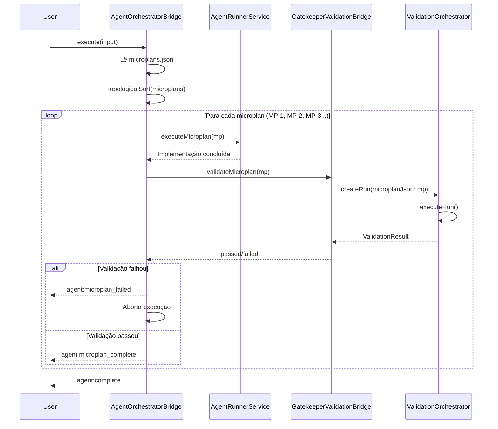

# 📋 Relatório: Implementação de Execução Individual de Microplans

**Data**: 2026-02-07
**Status**: Planejamento
**Objetivo**: Permitir execução sequencial de microplans individuais com validação por microplan

---

## 🎯 Resumo Executivo

### ✅ Infraestrutura Preparada (Concluída)

| Componente | Status | Detalhes |
|------------|--------|----------|
| **Schema Prisma** | ✅ | Campo `microplanJson` adicionado a `ValidationRun` |
| **ValidationOrchestrator** | ✅ | Refatorado para receber microplan via `run.microplanJson` |
| **GatekeeperValidationBridge** | ✅ | Interface aceita `microplanJson` como parâmetro |
| **Validators** | ✅ | 13 validators migrados para usar `ctx.microplan` |

### ❌ Implementação Pendente

**AgentOrchestratorBridge** precisa:
1. Executar microplans sequencialmente (respeitando `depends_on`)
2. Passar microplan específico (MP-1, MP-2, MP-3...) para validação
3. Suportar retry/fix por microplan individual

---

## 📊 Análise do Código Atual

### 1. **AgentOrchestratorBridge.ts**

**Caminho**: `packages/gatekeeper-api/src/services/AgentOrchestratorBridge.ts`
**Tamanho**: 2395 linhas
**Métodos principais**:
- `generatePlan()` - Linha 269
- `generateSpec()` - Linha 438
- `execute()` - Linha 683

#### 📍 Código Atual - Leitura de Microplans

```typescript
// Linha 474-489: generateSpec() lê microplans.json
const microplansData = JSON.parse(existingArtifacts['microplans.json'])

// ❌ PROBLEMA: Extrai apenas testFile do PRIMEIRO microplan
let testFilePath = 'spec.ts'
if (microplansData.microplans && Array.isArray(microplansData.microplans)) {
  for (const mp of microplansData.microplans) {
    if (mp.files && Array.isArray(mp.files)) {
      const testFile = mp.files.find((f: any) =>
        /\.(spec|test)\.(ts|tsx|js|jsx)$/.test(f.path)
      )
      if (testFile) {
        testFilePath = testFile.path
        break // ❌ Para no primeiro microplan
      }
    }
  }
}
```

**❌ Limitação**: Não há loop para executar cada microplan individualmente.

---

## 📁 Arquivos a Serem Modificados

### 1. **AgentOrchestratorBridge.ts** (Principal)

**Caminho**: `packages/gatekeeper-api/src/services/AgentOrchestratorBridge.ts`

#### 🔧 Mudanças Necessárias

##### A) Adicionar método `executeIndividualMicroplans()`

```typescript
/**
 * Executa microplans sequencialmente, respeitando depends_on.
 * Cada microplan é validado individualmente antes de prosseguir.
 */
private async executeIndividualMicroplans(
  microplansDoc: MicroplansDocument,
  input: BridgeExecuteInput,
  emit: (event: AgentEvent) => void
): Promise<void> {
  const { microplans } = microplansDoc
  const completed = new Set<string>()

  // Ordena microplans por depends_on (topological sort)
  const sorted = this.topologicalSort(microplans)

  for (const microplan of sorted) {
    emit({
      type: 'agent:microplan_start',
      microplanId: microplan.id,
      goal: microplan.goal,
    })

    try {
      // 1. Executar implementação do microplan
      await this.executeMicroplan(microplan, input, emit)

      // 2. Validar microplan individual
      const validationResult = await this.validateMicroplan(
        microplan,
        input.outputId,
        input.projectPath
      )

      if (!validationResult.passed) {
        emit({
          type: 'agent:microplan_failed',
          microplanId: microplan.id,
          failedValidators: validationResult.failedValidators,
        })
        throw new Error(`Microplan ${microplan.id} failed validation`)
      }

      completed.add(microplan.id)
      emit({
        type: 'agent:microplan_complete',
        microplanId: microplan.id,
      })
    } catch (error) {
      emit({
        type: 'agent:error',
        error: error instanceof Error ? error.message : String(error),
        phase: 'EXECUTION',
        microplanId: microplan.id,
      })
      throw error
    }
  }
}
```

##### B) Adicionar método `executeMicroplan()`

```typescript
/**
 * Executa a implementação de um microplan específico.
 */
private async executeMicroplan(
  microplan: Microplan,
  input: BridgeExecuteInput,
  emit: (event: AgentEvent) => void
): Promise<void> {
  // Monta prompt específico para este microplan
  const systemPrompt = await this.assembleMicroplanPrompt(microplan, input)

  // Executa agent LLM
  const result = await this.runner.run({
    systemPrompt,
    userPrompt: `Implement microplan ${microplan.id}: ${microplan.goal}`,
    tools: [...READ_TOOLS, ...WRITE_TOOLS],
    config: this.phaseConfig,
    onEvent: emit,
  })

  if (!result.success) {
    throw new Error(`Failed to execute microplan ${microplan.id}`)
  }
}
```

##### C) Adicionar método `validateMicroplan()`

```typescript
/**
 * Valida um microplan individual usando GatekeeperValidationBridge.
 */
private async validateMicroplan(
  microplan: Microplan,
  outputId: string,
  projectPath: string
): Promise<ValidationResult> {
  const bridge = new GatekeeperValidationBridge()

  return await bridge.validate({
    outputId,
    projectPath,
    taskDescription: microplan.goal,
    runType: 'EXECUTION',
    microplanJson: JSON.stringify(microplan), // ✅ Passa microplan específico
  })
}
```

##### D) Adicionar método `topologicalSort()`

```typescript
/**
 * Ordena microplans respeitando depends_on (topological sort).
 */
private topologicalSort(microplans: Microplan[]): Microplan[] {
  const sorted: Microplan[] = []
  const visited = new Set<string>()
  const visiting = new Set<string>()

  const visit = (mp: Microplan) => {
    if (visited.has(mp.id)) return
    if (visiting.has(mp.id)) {
      throw new Error(`Circular dependency detected: ${mp.id}`)
    }

    visiting.add(mp.id)

    for (const depId of mp.depends_on) {
      const dep = microplans.find(m => m.id === depId)
      if (!dep) {
        throw new Error(`Dependency not found: ${depId} (required by ${mp.id})`)
      }
      visit(dep)
    }

    visiting.delete(mp.id)
    visited.add(mp.id)
    sorted.push(mp)
  }

  for (const mp of microplans) {
    visit(mp)
  }

  return sorted
}
```

##### E) Modificar método `execute()` existente

**Linha ~683**: Adicionar flag para execução individual

```typescript
// ANTES (executa tudo de uma vez)
async execute(input: BridgeExecuteInput, callbacks: BridgeCallbacks = {}): Promise<AgentResult> {
  // ... código atual ...

  // Executa implementação
  const result = await this.runner.run({
    systemPrompt,
    userPrompt: input.taskDescription,
    // ...
  })

  return result
}

// DEPOIS (suporta execução individual)
async execute(input: BridgeExecuteInput, callbacks: BridgeCallbacks = {}): Promise<AgentResult> {
  const emit = (event: AgentEvent) => {
    callbacks.onEvent?.(event)
  }

  // Lê microplans.json
  const artifacts = await this.readArtifacts(input.outputId, input.projectPath)
  const microplansDoc = JSON.parse(artifacts['microplans.json']) as MicroplansDocument

  // ✅ NOVO: Execução individual de microplans
  if (input.individualExecution !== false) { // default: true
    await this.executeIndividualMicroplans(microplansDoc, input, emit)
    return { success: true, outputId: input.outputId }
  }

  // Fallback: execução monolítica (backward compatibility)
  // ... código atual ...
}
```

---

### 2. **BridgeExecuteInput Interface**

**Caminho**: `packages/gatekeeper-api/src/services/AgentOrchestratorBridge.ts` (linhas ~60-80)

#### 🔧 Adicionar campo

```typescript
export interface BridgeExecuteInput {
  outputId: string
  projectPath: string
  provider?: ProviderName
  model?: string
  // ... campos existentes ...

  /** Enable individual microplan execution (default: true) */
  individualExecution?: boolean // ✅ NOVO
}
```

---

### 3. **AgentEvent Types**

**Caminho**: `packages/gatekeeper-api/src/types/agent.types.ts`

#### 🔧 Adicionar eventos

```typescript
export type AgentEvent =
  // ... eventos existentes ...
  | { type: 'agent:microplan_start'; microplanId: string; goal: string }
  | { type: 'agent:microplan_complete'; microplanId: string }
  | { type: 'agent:microplan_failed'; microplanId: string; failedValidators: string[] }
  | { type: 'agent:error'; error: string; phase: string; microplanId?: string }
```

---

### 4. **Frontend - Orchestrator Page**

**Caminho**: `src/components/orchestrator-page.tsx`

#### 🔧 Adicionar handlers SSE

```typescript
// Handler para eventos de microplan
const handleSSE = useCallback((event: ServerSentEvent) => {
  // ... handlers existentes ...

  switch (event.type) {
    case 'agent:microplan_start': {
      addLog({
        level: 'info',
        message: `Iniciando microplan: ${event.goal}`,
        stage: 'execution',
        metadata: { microplanId: event.microplanId },
      })
      break
    }

    case 'agent:microplan_complete': {
      addLog({
        level: 'info',
        message: `Microplan concluído: ${event.microplanId}`,
        stage: 'execution',
      })
      break
    }

    case 'agent:microplan_failed': {
      addLog({
        level: 'error',
        message: `Microplan falhou: ${event.microplanId}`,
        stage: 'execution',
        metadata: { failedValidators: event.failedValidators },
      })
      break
    }
  }
}, [addLog])
```

---

## 🗺️ Fluxo de Execução (Proposto)



---

## 📋 Checklist de Implementação

### Backend

- [ ] **AgentOrchestratorBridge.ts**
  - [ ] Adicionar `executeIndividualMicroplans()`
  - [ ] Adicionar `executeMicroplan()`
  - [ ] Adicionar `validateMicroplan()`
  - [ ] Adicionar `topologicalSort()`
  - [ ] Modificar `execute()` para chamar execução individual
  - [ ] Adicionar campo `individualExecution` a `BridgeExecuteInput`

- [ ] **agent.types.ts**
  - [ ] Adicionar eventos `agent:microplan_*`

- [ ] **BridgeController.ts** (se necessário)
  - [ ] Verificar se endpoint `/execute` precisa mudanças

### Frontend

- [ ] **orchestrator-page.tsx**
  - [ ] Adicionar handlers SSE para eventos de microplan
  - [ ] Adicionar UI para mostrar progresso por microplan
  - [ ] Adicionar indicador de microplan atual

- [ ] **types.ts**
  - [ ] Adicionar tipos para eventos de microplan

### Testes

- [ ] **AgentOrchestratorBridge.spec.ts**
  - [ ] Testar `topologicalSort()` com dependências
  - [ ] Testar `topologicalSort()` com dependências circulares (deve falhar)
  - [ ] Testar execução sequencial de 3 microplans
  - [ ] Testar falha de validação no MP-2 (não deve executar MP-3)

- [ ] **E2E**
  - [ ] Criar teste end-to-end com 3 microplans sequenciais
  - [ ] Verificar que cada microplan é validado individualmente

---

## ⚠️ Considerações Importantes

### 1. **Backward Compatibility**

A flag `individualExecution` default é `true`, mas pode ser desabilitada para manter comportamento antigo:

```typescript
await bridge.execute({
  // ...
  individualExecution: false, // Usa execução monolítica antiga
})
```

### 2. **Performance**

Execução individual pode ser mais lenta (validação por microplan), mas oferece:
- ✅ Melhor isolamento de erros
- ✅ Feedback mais granular ao usuário
- ✅ Possibilidade de retry por microplan

### 3. **Dependências Circulares**

`topologicalSort()` deve detectar e falhar explicitamente:

```typescript
// ❌ INVÁLIDO
MP-1 depends_on: ["MP-2"]
MP-2 depends_on: ["MP-1"]

// ✅ VÁLIDO
MP-1 depends_on: []
MP-2 depends_on: ["MP-1"]
MP-3 depends_on: ["MP-1", "MP-2"]
```

### 4. **Tratamento de Erros**

Se MP-2 falhar:
- ❌ MP-3 NÃO deve ser executado (abort pipeline)
- ✅ Emitir `agent:microplan_failed` com detalhes
- ✅ Permitir retry apenas do MP-2

---

## 🎯 Exemplo Completo

### Input (microplans.json)

```json
{
  "task": "Adicionar autenticação JWT",
  "microplans": [
    {
      "id": "mp-001",
      "goal": "Criar middleware de autenticação",
      "depends_on": [],
      "files": [
        {
          "path": "src/middleware/auth.ts",
          "action": "CREATE",
          "what": "Middleware que verifica JWT token"
        },
        {
          "path": "src/middleware/auth.spec.ts",
          "action": "CREATE",
          "what": "Testes para middleware de autenticação"
        }
      ],
      "verify": "Verificar que middleware valida tokens válidos e rejeita inválidos"
    },
    {
      "id": "mp-002",
      "goal": "Integrar middleware nas rotas protegidas",
      "depends_on": ["mp-001"],
      "files": [
        {
          "path": "src/routes/protected.ts",
          "action": "EDIT",
          "what": "Adicionar middleware de auth nas rotas"
        }
      ],
      "verify": "Verificar que rotas protegidas exigem autenticação"
    }
  ]
}
```

### Execução

```
1️⃣ Executa MP-001
   → Cria auth.ts e auth.spec.ts
   → Valida (GatekeeperValidationBridge com microplanJson: MP-001)
   → ✅ PASSED

2️⃣ Executa MP-002 (depende de MP-001 ✅)
   → Modifica protected.ts
   → Valida (GatekeeperValidationBridge com microplanJson: MP-002)
   → ✅ PASSED

🎉 Pipeline completo
```

---

## 📊 Estimativa de Esforço

| Tarefa | Complexidade | Tempo Estimado |
|--------|--------------|----------------|
| Métodos individuais (execute, validate, sort) | Média | 2-3 horas |
| Modificação de execute() | Baixa | 30min |
| Tipos e interfaces | Baixa | 30min |
| Frontend handlers SSE | Baixa | 1 hora |
| Testes unitários | Média | 2 horas |
| Testes E2E | Alta | 2-3 horas |
| **TOTAL** | - | **8-10 horas** |

---

## 🚀 Próximos Passos

1. **Implementar backend** (AgentOrchestratorBridge + tipos)
2. **Implementar frontend** (handlers SSE + UI)
3. **Escrever testes** (unit + E2E)
4. **Testar manualmente** com microplans reais
5. **Documentar** em CLAUDE.md e README

---

**Documento gerado em**: 2026-02-07
**Autor**: Claude Sonnet 4.5
**Status**: Planejamento completo ✅
